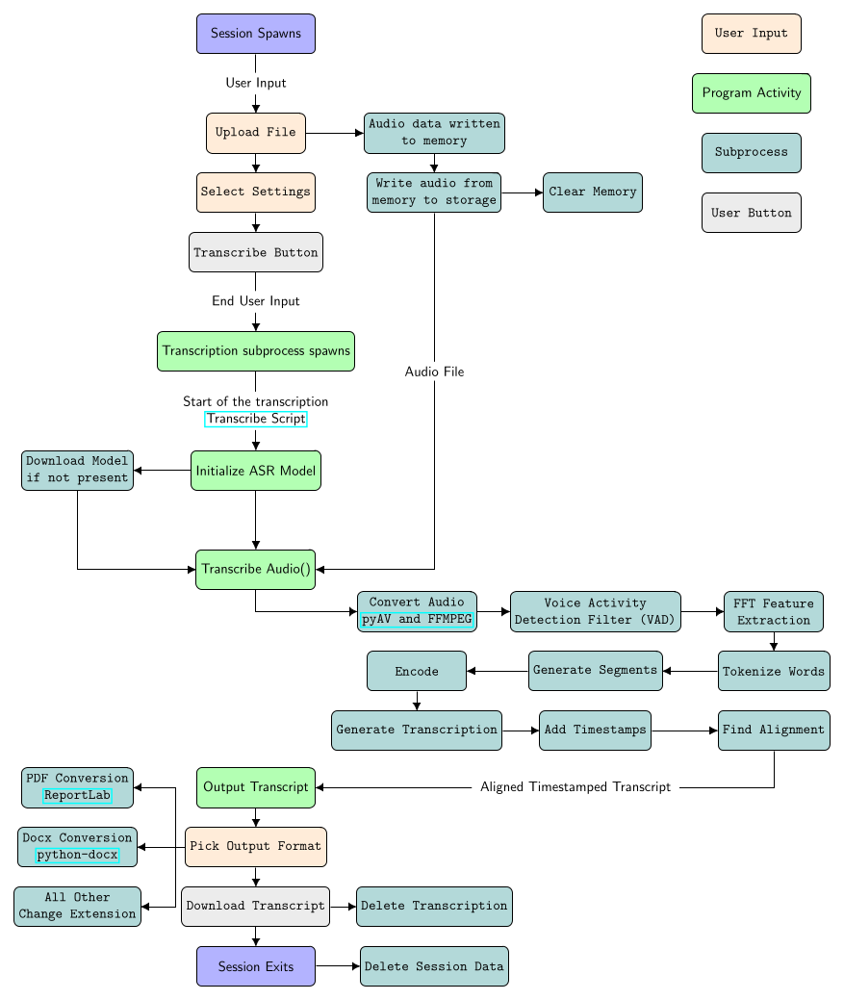

# Offline Automatic Speech Recognition Application

## Description
This application was developed using streamlit. The purpose of this project is to allow for Automatic Speech Recognition without uploaded audio files to a company server. This alleviates any issues with ethics with uploaded sensitive data.

This Webapp implements the faster-whisper package <https://github.com/SYSTRAN/faster-whisper> and the vosk package <https://github.com/alphacep/vosk-api/tree/master> models.

## Visuals
The overall architecture of the webapp is provided as following:



## Getting started

This package is meant to be run with a python virtual environment.

To make a virtual environment and download all the requirements:

```
cd repository
python3 -m venv .venv
source .venv/bin/activate
pip install -r requirements.txt
```

You will also need to install ffmpeg:

```
sudo apt install ffmpeg
```

## Running the Webapp

The basic commands for running the webapp are:

```
streamlist run main.py
```

If you want to run on a specific port, say 8051 in this example:

```
streamlit run main.py --server.port 8051
```

***

## License
Offline Automatic Speech Recognition Application (c) by Michael Coe

Offline Automatic Speech Recognition Application is licensed under a
Creative Commons Attribution 4.0 International License.

You should have received a copy of the license along with this
work. If not, see <https://creativecommons.org/licenses/by/4.0/>

## Project status
Active
